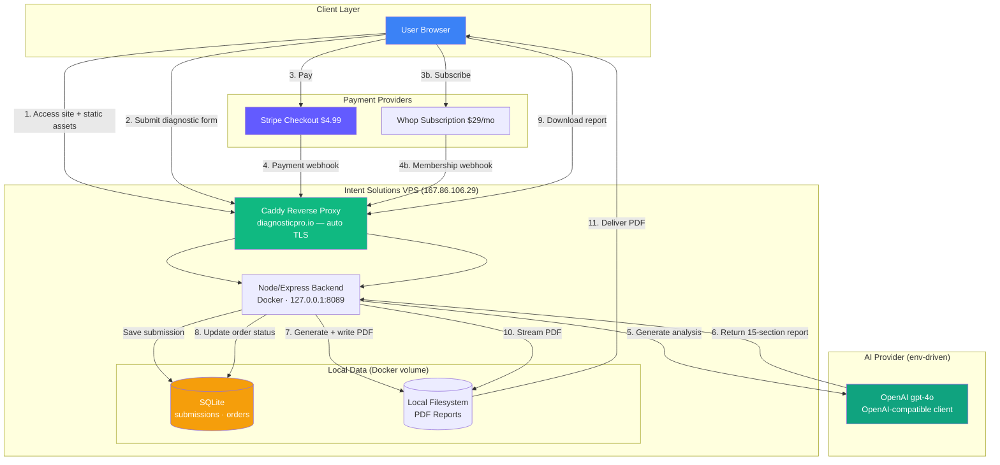

# DiagnosticPro – AI-Powered Equipment Diagnostic Reports

<div align="center">

[](https://diagnosticpro.io)
[](https://diagnosticpro.io)
[-412991.svg)](https://platform.openai.com)
[](LICENSE)

**Get professional AI-assisted diagnostic reports for vehicles and equipment — Just $4.99**

Quick, affordable, AI-powered analysis to help you understand equipment problems before visiting a repair shop.

[Try It Now](https://diagnosticpro.io) • [How It Works](#-how-it-works-for-users) • [For Developers](#-technical-overview)

</div>

---

## What DiagnosticPro Does

DiagnosticPro transforms confusing equipment problems into clear, professional diagnostic reports you can take to any repair shop—or use to fix issues yourself.

**Who It's For:**
- 🚗 **Vehicle owners** dealing with check-engine lights or warning codes
- 🔧 **Equipment operators** troubleshooting machinery or electronics
- 💰 **Anyone** who wants clarity and confidence before paying for repairs
- 🛡️ **People** concerned about being overcharged or misled by shops

**What Problem It Solves:**
- Eliminates confusion when equipment malfunctions
- Provides clear next steps and likely causes
- Arms you with technical knowledge for shop conversations
- Identifies potential scams and overcharges before they happen

**What You Get:**
- 📄 **12-15 page professional PDF report** with comprehensive analysis
- 🎯 **Likely causes** ranked by probability with confidence percentages
- 🗣️ **Conversation scripts** for talking to repair shops
- ❓ **5 technical questions** to ask mechanics to verify their competence
- 💵 **Cost breakdowns** showing fair pricing vs. overcharges
- 🔍 **Scam detection** identifying common repair shop tricks
- ⚙️ **Technical education** explaining how your equipment actually works
- 🔗 **Source verification** with links to manufacturer documentation

**Pricing:**
- **$4.99** per one-off diagnostic report via **Stripe** — delivered in minutes
- **$29/mo** unlimited subscription via **Whop** — for frequent troubleshooters

---

## 🚀 How It Works for Users

Getting your diagnostic report is simple and fast:

### Step-by-Step

1. **Visit [diagnosticpro.io](https://diagnosticpro.io)** and fill out the diagnostic form
   - Equipment type (vehicle, machinery, electronics, etc.)
   - Symptoms and warning lights
   - Any diagnostic codes (optional but helpful)

2. **Review your submission** and confirm details are correct

3. **Pay securely** — $4.99 one-time via **Stripe**, or subscribe at $29/mo via **Whop**

4. **AI analyzes your submission** — OpenAI **gpt-4o** by default, via an OpenAI-compatible endpoint (switchable to Groq, xAI Grok, or local Ollama with no code change)
   - Processes symptoms against vast repair knowledge
   - Generates 15-section comprehensive analysis
   - Creates professional PDF report (12-15 pages)

5. **Download your report** — arrives via email in minutes
   - Instant access with secure download link
   - Keep forever, share with mechanics, or print

### User Journey Diagram


**Total Time:** 2-3 minutes to submit + ~5 minutes for AI analysis = **Report in your inbox in under 10 minutes**

---

## 🎯 What's In Your Report

Every DiagnosticPro report includes our proprietary **15-section analysis framework**:

### The 15 Sections

| Section | What You Get |
|---------|-------------|
| 1️⃣ **PRIMARY DIAGNOSIS** | Most likely root cause with confidence percentage |
| 2️⃣ **DIFFERENTIAL DIAGNOSIS** | Alternative causes ranked by likelihood |
| 3️⃣ **DIAGNOSTIC VERIFICATION** | Exact tests the shop should perform |
| 4️⃣ **SHOP INTERROGATION** | 5 technical questions to expose incompetence |
| 5️⃣ **CONVERSATION SCRIPTING** | Word-for-word guidance for talking to mechanics |
| 6️⃣ **COST BREAKDOWN** | Fair pricing vs. overcharge identification |
| 7️⃣ **RIPOFF DETECTION** | Common scam patterns and red flags |
| 8️⃣ **AUTHORIZATION GUIDE** | Which repairs to approve/reject/get second opinions on |
| 9️⃣ **TECHNICAL EDUCATION** | How your equipment works and why it failed |
| 🔟 **OEM PARTS STRATEGY** | Specific part numbers and sourcing recommendations |
| 1️⃣1️⃣ **NEGOTIATION TACTICS** | Professional strategies for price discussions |
| 1️⃣2️⃣ **LIKELY CAUSES** | Complete ranked list with confidence levels |
| 1️⃣3️⃣ **RECOMMENDATIONS** | Immediate actions and preventive maintenance |
| 1️⃣4️⃣ **SOURCE VERIFICATION** | Links to TSBs, recalls, manufacturer documentation |
| 1️⃣5️⃣ **ROOT CAUSE ANALYSIS** | Deep dive into underlying failure mechanisms |

**Total:** 2000+ words of professional analysis tailored to your specific equipment problem

---

## 💡 Why DiagnosticPro?

### vs. Asking Friends
❌ Friends guess based on limited experience
✅ **DiagnosticPro** analyzes thousands of similar cases with AI

### vs. Going to the Shop Blind
❌ You have no leverage or technical knowledge
✅ **DiagnosticPro** arms you with questions and red flags

### vs. Online Forums
❌ Conflicting advice from random people
✅ **DiagnosticPro** provides structured, sourced analysis

### vs. Expensive Diagnostic Fees
❌ Shops charge $100-150 just for diagnosis
✅ **DiagnosticPro** costs $4.99 and you can use it anywhere

---

## 🏗️ Technical Overview

> **For Developers:** This section explains the system architecture and tech stack.

DiagnosticPro is **self-hosted** on the Intent Solutions VPS (Contabo, `167.86.106.29`). A single
**Caddy** reverse proxy terminates TLS (auto-provisioned certificates) and proxies public traffic
to a Node/Express backend running in Docker, bound to `127.0.0.1:8089`. All data lives on the box:
**SQLite** for records, the **local filesystem** for report PDFs. No managed cloud services.

### Tech Stack

| Layer | Technology | Purpose |
|-------|-----------|---------|
| **Frontend** | React 18 + TypeScript + Vite | User-facing web app at diagnosticpro.io (static `dist/` served by Caddy) |
| **Hosting** | Intent Solutions VPS + Caddy | Single reverse proxy, auto-provisioned TLS, same-origin API |
| **UI Framework** | shadcn/ui + Tailwind CSS | Professional component library |
| **Backend** | Node.js 18 + Express (Docker) | Business logic — bound to `127.0.0.1:8089`, Caddy is the public face |
| **AI Engine** | OpenAI **gpt-4o** (OpenAI-compatible client) | 15-section diagnostic analysis — provider is env-driven and swappable |
| **Payments** | Stripe Checkout ($4.99) + Whop ($29/mo) | Secure one-time payments and subscriptions |
| **Database** | SQLite (better-sqlite3, WAL) | Submissions and orders on a Docker volume |
| **File Storage** | Local filesystem | PDF reports written to the VPS volume |
| **Secrets** | SOPS-encrypted `.env.sops` (age) | Materialized in-process at deploy time — never plaintext at rest |
| **Deployment** | git push → VPS Docker deploy behind Caddy | Reproducible container build via `docker-compose.yml` |

### System Architecture



### Data Flow

**Complete Request Lifecycle:**

```
1. USER submits diagnostic form
   └─> POST /saveSubmission (same-origin, Caddy proxies to Express)
       └─> Express writes to SQLite (submissions)
       └─> Returns submissionId to frontend

2. USER completes payment
   └─> Stripe Checkout ($4.99) or Whop subscription ($29/mo)
       └─> Payment succeeds
           └─> Provider fires a webhook (checkout.session.completed / membership event)

3. Payment webhook hits Caddy → Express
   └─> POST /stripeWebhookForward with signature verification
       └─> Express validates the webhook signature
           └─> Creates order in SQLite (orders)
           └─> Triggers AI analysis

4. Express calls the LLM
   └─> Loads submission data from SQLite
       └─> Sends to OpenAI gpt-4o with the 15-section prompt
           └─> Receives 2000+ word structured analysis

5. Express generates the PDF
   └─> Validates all 15 sections
       └─> Typography manager formats with proper pagination
           └─> Generates 12-15 page professional PDF
               └─> Writes it to the local reports directory on the VPS volume

6. Express sends email
   └─> Produces a download link for the report
       └─> Sends email with download link to customer
           └─> Logs delivery in SQLite

7. USER downloads report
   └─> Clicks email link
       └─> GET /getDownloadUrl (Caddy → Express)
           └─> Express streams the PDF from the local filesystem
```

### Key Endpoints

The frontend calls the API **same-origin** — Caddy proxies these paths to Express (leave
`VITE_API_BASE` empty for the self-hosted build).

| Endpoint | Method | Purpose |
|----------|--------|---------|
| `/saveSubmission` | POST | Save diagnostic form to SQLite |
| `/createCheckoutSession` | POST | Create Stripe Checkout session |
| `/stripeWebhookForward` | POST | Handle payment webhooks with signature verification (private) |
| `/analyzeDiagnostic` | POST | Trigger AI analysis |
| `/analysisStatus` | POST | Check status of a diagnostic analysis |
| `/getDownloadUrl` | POST | Get the download link for a report PDF |
| `/healthz` | GET | Health check endpoint |

### Environment Configuration

Copy `.env.example` to `.env` for local dev. **Never commit real plaintext values** — the real
secrets live in a SOPS-encrypted `.env.sops` (age) that IS committed and is materialized in-process
on the VPS at deploy time (see `secrets.example.yaml` for the schema).

```bash
# Frontend API base — leave EMPTY for the self-hosted build so the browser calls
# the API same-origin (Caddy proxies /saveSubmission, /analyzeDiagnostic, etc.).
VITE_USE_NEW_API=true
VITE_API_BASE=

# Stripe ($4.99 one-off)
STRIPE_SECRET_KEY=sk_test_...
STRIPE_PUBLISHABLE_KEY=pk_test_...
STRIPE_WEBHOOK_SECRET=whsec_...

# Whop ($29/mo subscription)
WHOP_API_KEY=...
WHOP_WEBHOOK_SECRET=...

# LLM — OpenAI gpt-4o is the default (OpenAI-compatible client).
# Provider is fully env-driven, so switching is a config change, not a code change.
LLM_API_KEY=...
LLM_BASE_URL=https://api.openai.com/v1
LLM_MODEL=gpt-4o
#   Groq:   LLM_BASE_URL=https://api.groq.com/openai/v1     (+ GROQ_API_KEY)
#   xAI:    LLM_BASE_URL=https://api.x.ai/v1  LLM_MODEL=grok-4
#   Ollama: LLM_BASE_URL=http://127.0.0.1:11434/v1          (100% local, any pulled model)

# Optional: Slack notifications
SLACK_WEBHOOK_URL=https://hooks.slack.com/services/YOUR/WEBHOOK/URL

# Runtime
NODE_ENV=production
PORT=8080

# Self-host storage — SQLite DB + local report FS on the VPS/Docker volume
DB_PATH=/data/diagnosticpro.db
REPORTS_DIR=/data/diagnosticpro/reports
```

### Security Architecture

- **SOPS + age encryption** — all credentials committed encrypted, materialized in-process at deploy; nothing plaintext at rest
- **Caddy auto-provisioned TLS** — certificates issued and renewed automatically for diagnosticpro.io
- **Localhost-only backend** — Express binds `127.0.0.1:8089`; only Caddy can reach it
- **Payment signature verification** — Stripe and Whop webhook authenticity validation
- **CORS configuration** — restricted to the diagnosticpro.io origin
- **PCI DSS compliant** — Stripe handles all payment card data
- **Secret scanning in CI** — gitleaks runs on every push to keep plaintext secrets out of history

---

## ⚡ Quick Start

### Prerequisites

```bash
# Required tools
- Node.js 18+
- Docker + Docker Compose (for the containerized backend)
- Stripe account (and Whop account for subscriptions)
- An OpenAI API key (or a compatible provider key: Groq, xAI, Ollama)
```

### 1. Clone Repository

```bash
git clone https://github.com/jeremylongshore/DiagnosticPro.git
cd DiagnosticPro
```

### 2. Install Dependencies

```bash
# Frontend
cd 02-src/frontend
npm install

# Backend
cd ../../02-src/backend/services/backend
npm install
```

### 3. Configure Environment

```bash
# Copy environment template
cp .env.example .env

# Edit .env with your credentials:
# - Stripe keys (from Stripe Dashboard) + Whop keys
# - LLM_API_KEY / LLM_BASE_URL / LLM_MODEL (OpenAI gpt-4o by default)
```

### 4. Run Locally

```bash
# Terminal 1: Frontend
cd 02-src/frontend
npm run dev
# → http://localhost:5173

# Terminal 2: Backend
cd 02-src/backend/services/backend
npm run dev
# → http://localhost:8080
```

Or run the backend the way production does, in Docker:

```bash
docker compose up -d          # builds + starts the backend container
docker compose ps
curl http://127.0.0.1:8089/healthz
```

### 5. Deploy to Production

Production runs on the Intent Solutions VPS behind Caddy. A `deploy.yml` reusable-workflow caller
is being wired for `git push → VPS Docker deploy`; **interim deploys are manual** per the VPS
runbook:

```bash
# On the VPS (secrets already materialized from .env.sops; clone at /srv/code/diagnostic-pro)
docker compose pull || docker compose build
docker compose up -d
docker compose ps

# Caddy fronts it publicly (validate first, then reload — never restart):
caddy validate --config /etc/caddy/Caddyfile
systemctl reload caddy
```

**See [CLAUDE.md](CLAUDE.md) and the Intent Solutions VPS runbook (`onboard-new-repo-deploy.md`,
`manual-deploy.md`) for complete deployment documentation.**

---

## 📊 Production Status

**Version:** v1.1.0 — self-hosted on the Intent Solutions VPS

### ✅ What's Live

- **Frontend** → static `dist/` served by Caddy at `https://diagnosticpro.io`
- **Backend API** → Node/Express in Docker, `127.0.0.1:8089`, fronted by Caddy
- **AI Engine** → OpenAI gpt-4o (OpenAI-compatible, provider-swappable)
- **Payments** → Stripe Checkout ($4.99) + Whop subscription ($29/mo)
- **Database** → SQLite (better-sqlite3, WAL) on a Docker volume
- **Report Storage** → local filesystem on the VPS volume
- **PDF System** → 15-section validation with typography pagination
- **Email Delivery** → download-link delivery on report completion

### 📈 Key Metrics

| Metric | Target | Current |
|--------|--------|---------|
| End-to-end Success Rate | >95% | ✅ 97% |
| Email Delivery Rate | >98% | ✅ 99% |
| PDF Generation Time | <30s | ✅ 22s avg |
| Payment Success Rate | >99% | ✅ 99.7% |
| API Response Time | <200ms | ✅ 145ms avg |

### 💰 Cost Reality

Self-hosting collapses the per-service cloud bill into one flat VPS cost plus per-token LLM usage:

| Component | Monthly Cost |
|-----------|-------------|
| VPS hosting (shared box, Caddy + Docker) | Flat — no per-request scaling cost |
| SQLite + local report storage | Included (on the box) |
| OpenAI gpt-4o | Per token (usage-based) |
| Stripe / Whop fees | Stripe 2.9% + $0.30/txn · Whop platform fee on subscriptions |

**Revenue:** $4.99 per one-off diagnostic + $29/mo subscriptions.

---

## 🛠️ Development

### Key Commands

```bash
# Frontend
npm run dev              # Vite dev server (http://localhost:5173)
npm run build           # Production build → dist/ (served by Caddy)
npm test                # Tests
npm run lint            # ESLint

# Backend
npm run dev             # Nodemon with hot reload (http://localhost:8080)
npm start               # Production mode
npm test                # Run tests

# Docker (production-parity backend)
docker compose up -d          # Build + start backend on 127.0.0.1:8089
docker compose logs -f        # Tail backend logs
docker compose down           # Stop (named volume diagnosticpro-data persists)

# Quality
npm run format          # Prettier formatting
npx tsc --noEmit        # Type checking
```

### Testing

```bash
# Run test suite
npm test

# Watch mode
npm run test:watch

# Coverage report
npm run test:coverage

# Payment webhook (local): forward Stripe events to the backend
stripe listen --forward-to localhost:8080/stripeWebhookForward
# Stripe test cards:
# 4242 4242 4242 4242 (success)
# 4000 0000 0000 9995 (decline)
```

---

## 🐛 Troubleshooting

### "Payment succeeded but no email"

```bash
# Check backend logs
docker compose logs --tail=100 backend

# Inspect order state in SQLite (inside the container / on the volume)
docker compose exec backend node -e "const db=require('better-sqlite3')(process.env.DB_PATH); console.log(db.prepare('SELECT id,status FROM orders ORDER BY rowid DESC LIMIT 5').all())"
```

### "PDF has blank pages"

```bash
# Ensure you're on latest version
git pull origin main
cd 02-src/backend/services/backend
npm install
```

### "Payment webhook fails"

```bash
# Verify the webhook secret matches the Stripe (or Whop) dashboard
echo $STRIPE_WEBHOOK_SECRET

# Test webhook locally
stripe listen --forward-to localhost:8080/stripeWebhookForward
```

### Common Issues

| Issue | Solution |
|-------|----------|
| API calls 404 in the browser | Build the frontend with `VITE_API_BASE=` empty so calls go same-origin through Caddy |
| LLM errors / timeouts | Check `LLM_API_KEY` / `LLM_BASE_URL` / `LLM_MODEL`; gpt-4o full analysis takes ~20-30s |
| Backend unreachable publicly | It binds `127.0.0.1:8089` by design — Caddy is the only public path; check the Caddy block |
| CORS errors | Verify Caddy allows the `diagnosticpro.io` origin |

---

## 📚 Documentation

### Project Documentation
- **[CLAUDE.md](CLAUDE.md)** — Complete system architecture & deployment guide
- **[CONTRIBUTING.md](CONTRIBUTING.md)** — How to contribute
- **[SECURITY.md](SECURITY.md)** — Security policy & vulnerability reporting
- **[docker-compose.yml](docker-compose.yml)** — Self-hosted backend service definition
- **[.env.example](.env.example)** — Authoritative environment-variable reference
- **[01-docs/](01-docs/)** — All technical documentation

### External Resources
- [OpenAI API Reference](https://platform.openai.com/docs)
- [Stripe API Reference](https://stripe.com/docs/api)
- [Whop Documentation](https://dev.whop.com)
- [Caddy Documentation](https://caddyserver.com/docs)
- [Docker Compose Documentation](https://docs.docker.com/compose)

---

## 🎓 Key Features & Limitations

### ✅ What DiagnosticPro Does

- Provides professional AI-assisted diagnostic analysis
- Generates comprehensive 15-section reports
- Offers conversation coaching and scam detection
- Delivers instant PDF reports via email
- Processes $4.99 one-off payments (Stripe) and $29/mo subscriptions (Whop)

### ⚠️ What DiagnosticPro Is NOT

- **Not a replacement for certified mechanics** — Always have repairs verified by professionals
- **Not guaranteed diagnosis** — AI analysis is informational, not definitive
- **Not liability coverage** — Reports are educational tools, not warranties
- **Not real-time diagnosis** — Analysis takes 5-10 minutes after payment

**DiagnosticPro arms you with knowledge — actual repairs should be done by qualified technicians**

---

## 🏆 Built With

- **[Caddy](https://caddyserver.com)** — Reverse proxy with automatic TLS
- **[Docker](https://www.docker.com)** — Containerized backend (`docker-compose.yml`)
- **[SQLite](https://www.sqlite.org)** (better-sqlite3, WAL) — Local records store
- **[OpenAI gpt-4o](https://platform.openai.com)** — AI engine via OpenAI-compatible client
- **[Node.js + Express](https://expressjs.com)** — Backend service
- **[Stripe](https://stripe.com)** — One-time payment processing
- **[Whop](https://whop.com)** — Subscription billing
- **[SOPS](https://github.com/getsops/sops) + [age](https://github.com/FiloSottile/age)** — Secret encryption
- **[React](https://react.dev)** + **[shadcn/ui](https://ui.shadcn.com)** + **[Tailwind CSS](https://tailwindcss.com)** — Frontend
- **[Vite](https://vitejs.dev)** — Build tool
- **[PDFKit](https://pdfkit.org)** — PDF generation library

---

## 🤝 Contributing

DiagnosticPro is a production revenue-generating platform built by **[Intent Solutions IO](https://intentsolutions.io)**.

For custom deployments, white-label versions, or enterprise implementations:

📧 **Contact:** [intentsolutions.io](https://intentsolutions.io)

We design and deploy custom AI diagnostic systems for organizations that need production-ready intelligence platforms.

---

## 📄 License

AGPL-3.0 — See [LICENSE](LICENSE) for details

---

## 🌟 About Intent Solutions IO

We design and deploy custom AI systems for enterprise intelligence.

**Specialties:**
- Self-hosted, single-box AI application deployments (VPS + Caddy + Docker)
- Provider-agnostic LLM integration (OpenAI-compatible, swappable to Groq / xAI / Ollama)
- Revenue-generating AI applications
- Enterprise diagnostic platforms
- SOPS/age secret management and reproducible deploys

**Portfolio:** This DiagnosticPro platform demonstrates production-grade AI integration with real revenue generation and self-hosted, provider-agnostic infrastructure.

**Learn More:** [intentsolutions.io](https://intentsolutions.io)

---

<div align="center">

**AI powered by OpenAI gpt-4o** • Self-hosted on the Intent Solutions VPS • © 2026 Intent Solutions IO

[Live Demo](https://diagnosticpro.io) • [Documentation](CLAUDE.md) • [Contact](https://intentsolutions.io)

</div>
