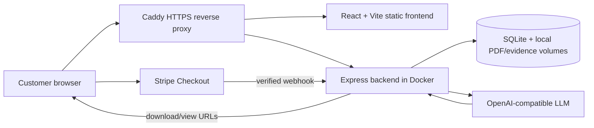

# DiagnosticPro

DiagnosticPro turns a vehicle or equipment problem into a structured,
AI-assisted diagnostic report. A customer describes the problem, optionally
adds photos or a work order, pays through Stripe, and receives a downloadable
PDF with likely causes, verification steps, questions for a repair shop, cost
context, and next actions.

<div align="center">

[](https://diagnosticpro.io)
[](https://github.com/jeremylongshore/DiagnosticPro/actions/workflows/ci.yml)
[](LICENSE)
<a href="https://ko-fi.com/U5S225PTME"></a>

</div>

> DiagnosticPro is decision support, not a certified diagnosis. A qualified
> technician should verify safety-critical findings before repair.

## Product flow

1. The customer completes the diagnostic form for a vehicle, machine, or other
   equipment.
2. The frontend saves the submission and receives a submission ID plus a
   submission-scoped evidence token.
3. Before payment, the customer may attach up to three photos and up to five
   text-bearing documents such as work orders, PDFs, DOCX files, TXT, CSV, or
   JSON. Attachments are private and are only changeable while the submission
   is pending.
4. Stripe Checkout handles the current $4.99 one-off purchase.
5. A verified payment webhook marks the submission paid and queues the
   analysis. The backend sends the form data and any usable evidence to an
   OpenAI-compatible LLM.
6. The backend generates and stores a PDF locally. The success page polls for
   readiness and provides the browser with download and view links.

The report prompt currently requires 15 sections and targets roughly
2,000–2,500 words. The exact page count varies with the case and generated
content. The current backend does not send email; customers download from the
post-checkout browser flow.

## What the report covers

The analysis framework includes:

- primary and differential diagnoses;
- diagnostic verification tests and expected evidence;
- questions and conversation scripts for a repair shop;
- cost and quote review guidance;
- authorization, parts, and negotiation guidance;
- technical education, recommendations, and warning signs;
- ranked likely causes with confidence; and
- source verification and a three-step next-action summary.

Images can be described by the configured vision-capable model. Text-bearing
documents are parsed before analysis. Scanned PDFs are retained as evidence
but marked `needs_ocr` and are not represented as understood text.

## Current scope and limitations

- The production frontend's primary paid path is Stripe Checkout at $4.99.
- Whop membership and webhook endpoints remain in the backend, but the current
  frontend comments identify the Whop UI as deferred; do not treat it as the
  primary customer flow without verifying the deployed build.
- Reports and SQLite data are stored on the self-hosted VPS volume. There is no
  active Firebase, Firestore, Google Cloud Storage, or Vertex AI dependency in
  the main path.
- The application does not replace an inspection, scan-tool session, service
  manual, recall lookup, or qualified repair professional.
- API and analysis endpoints are rate-limited. Evidence files are stored
  outside the public static directory and addressed through an access token.

## Architecture



Production is a self-hosted deployment on the Intent Solutions VPS:

- Caddy terminates TLS and serves the built frontend.
- The backend container listens on `127.0.0.1:8089` through the Compose
  mapping and listens on port `8080` inside the container.
- SQLite, generated reports, and private uploads live on persistent Docker
  volumes.
- LLM provider, model, payment credentials, and storage paths are configured
  through environment variables.

## Repository layout

| Path                                                                                       | Purpose                                                                      |
| ------------------------------------------------------------------------------------------ | ---------------------------------------------------------------------------- |
| [`02-src/frontend/`](02-src/frontend/)                                                     | React 18 + TypeScript + Vite application                                     |
| [`02-src/backend/services/backend/`](02-src/backend/services/backend/)                     | Express API, SQLite access, evidence handling, LLM calls, and PDF generation |
| [`02-src/backend/services/backend/__tests__/`](02-src/backend/services/backend/__tests__/) | Backend Jest tests                                                           |
| [`02-src/frontend/src/src/`](02-src/frontend/src/src/)                                     | Frontend source (the repository intentionally has a nested `src/src` path)   |
| [`02-src/frontend/e2e/`](02-src/frontend/e2e/)                                             | Local Playwright browser tests                                               |
| [`02-src/frontend/e2e-live/`](02-src/frontend/e2e-live/)                                   | Real deployed-site customer-journey tests                                    |
| [`tests/`](tests/)                                                                         | Test plans, journey evidence, and validation scripts                         |
| [`docker-compose.yml`](docker-compose.yml)                                                 | Production-parity backend and test-surface services                          |
| [`.env.example`](.env.example)                                                             | Environment-variable template; never add real credentials                    |
| [`.github/workflows/ci.yml`](.github/workflows/ci.yml)                                     | CI tests, builds, audit, and optional live journey                           |
| [`.github/workflows/deploy.yml`](.github/workflows/deploy.yml)                             | Main-branch VPS deployment and test-surface parity checks                    |

## Development setup

### Prerequisites

- Node.js 20 for the frontend toolchain;
- Node.js 24 for the backend, matching the Docker image and CI;
- pnpm 10 for frontend installs and scripts;
- npm for backend installs and scripts; and
- Docker Compose for the production-parity backend.

Payment and analysis work also needs Stripe credentials and an API key for the
configured LLM. Frontend-only tests and most backend tests do not need live
provider credentials.

### Install

```bash
git clone https://github.com/jeremylongshore/DiagnosticPro.git
cd DiagnosticPro

corepack enable
cd 02-src/frontend
pnpm install --frozen-lockfile

cd ../../backend/services/backend
npm ci
```

### Configure

From the repository root:

```bash
cp .env.example .env
```

Set the values needed for the flow you are exercising. At minimum, a real
analysis requires:

```dotenv
LLM_API_KEY=...
LLM_BASE_URL=https://api.openai.com/v1
LLM_MODEL=gpt-4o
```

The backend uses an OpenAI-compatible client. Change `LLM_BASE_URL` and
`LLM_MODEL` to use another compatible provider, or point it at Ollama. Stripe
variables are required for Checkout and webhook tests. The complete variable
list, including evidence storage and optional vision settings, is in
[`.env.example`](.env.example).

Never commit `.env` or plaintext production secrets. Production secrets are
materialized from the tracked SOPS-encrypted [`.env.sops`](.env.sops) by the
deployment environment.

### Run the frontend

```bash
cd 02-src/frontend
pnpm dev
```

Vite serves the frontend on its normal development port. For a local frontend
build that calls a backend at a different origin, set `VITE_API_BASE` (or
`VITE_API_GATEWAY_URL`) before starting Vite. For the production self-hosted
build, leave the API base empty so the browser uses same-origin paths behind
Caddy:

```bash
VITE_API_BASE= pnpm build
```

### Run the backend directly

The backend reads configuration from the process environment; it does not load
`.env` automatically. The following keeps local SQLite and generated files in
the service directory while importing the root template:

```bash
cd 02-src/backend/services/backend
set -a
. ../../../../.env
set +a
mkdir -p .data/reports .data/uploads
NODE_ENV=development \
PORT=8080 \
DB_PATH="$PWD/.data/diagnosticpro.db" \
REPORTS_DIR="$PWD/.data/reports" \
EVIDENCE_UPLOADS_DIR="$PWD/.data/uploads" \
npm run dev
```

Check the service with:

```bash
curl http://127.0.0.1:8080/healthz
```

### Run Docker Compose

Compose is the recommended production-parity backend path. It starts the
production backend and the isolated test surface, each with its own data
volume:

```bash
docker compose up -d --build
docker compose ps
curl http://127.0.0.1:8089/healthz
docker compose logs -f backend
```

Stop the containers without removing named volumes:

```bash
docker compose down
```

## API surface

The frontend normally calls these paths same-origin. Caddy proxies them to the
backend in production.

| Method   | Path                                  | Purpose                                                    |
| -------- | ------------------------------------- | ---------------------------------------------------------- |
| `GET`    | `/healthz`                            | Health and deployed revision check                         |
| `POST`   | `/saveSubmission`                     | Validate and persist a pending submission                  |
| `GET`    | `/evidence/:submissionId`             | List private evidence metadata using `x-evidence-token`    |
| `POST`   | `/evidence/:submissionId`             | Upload one JPEG, PNG, or WebP photo                        |
| `POST`   | `/evidence/:submissionId/document`    | Upload and parse one PDF, DOCX, TXT, CSV, or JSON document |
| `DELETE` | `/evidence/:submissionId/:evidenceId` | Delete pending evidence                                    |
| `POST`   | `/createCheckoutSession`              | Create the $4.99 Stripe Checkout session                   |
| `POST`   | `/stripeWebhookForward`               | Verify and process Stripe payment events                   |
| `POST`   | `/analyzeDiagnostic`                  | Queue or trigger analysis                                  |
| `POST`   | `/analysisStatus`                     | Poll analysis status                                       |
| `GET`    | `/reports/signed-url`                 | Return report view/download URLs when ready                |
| `GET`    | `/reports/download/:submissionId`     | Stream a generated PDF from local storage                  |
| `GET`    | `/view/:submissionId`                 | Resolve a report view request                              |

The evidence token is returned once by `/saveSubmission`. The backend stores
only its SHA-256 hash. Evidence mutations fail after payment, and the raw
private upload paths are never served as static files.

## Quality gates

Run commands from the directory shown.

### Frontend

```bash
cd 02-src/frontend
pnpm test
pnpm run build
pnpm run lint
npx tsc --noEmit
pnpm exec prettier --check "src/**/*.{ts,tsx,js,jsx,json,css,md}"
```

Local browser tests run Playwright against the built frontend preview server:

```bash
pnpm run build
pnpm run test:e2e
```

The live journey suite targets a deployed site and must never be pointed at a
production Stripe live-key surface with test-payment flags:

```bash
PLAYWRIGHT_BASE_URL=https://test.diagnosticpro.io pnpm run test:live:test
```

Use the coupon or payment variants only with an intentionally configured
Stripe test-mode target. See [`tests/JOURNEYS.md`](tests/JOURNEYS.md).

### Backend

```bash
cd 02-src/backend/services/backend
npm ci
npx jest --coverage
node --check index.js
```

The backend coverage threshold is enforced by its Jest configuration. The
production Docker image also installs the PDF toolchain used for document
parsing and report generation.

The root [`Makefile`](Makefile) contains convenience targets, but several of
them still assume a root-level `package.json`. The frontend test/build and
backend test commands above match CI; lint, type, and formatting commands are
additional local checks.

## Deployment

Pushing to `main` triggers the GitHub Actions deployment workflow after its
frontend build and backend syntax gates pass. The reusable VPS workflow then:

1. updates the checkout on the VPS;
2. builds and starts the Compose backend services;
3. builds the frontend and syncs `dist/` to the Caddy static root;
4. checks the production `/healthz` endpoint; and
5. verifies that `test.diagnosticpro.io` is healthy, on the same commit, and
   exposes the evidence-document route.

Deployment authority and required GitHub/VPS configuration live in
[`deploy.yml`](.github/workflows/deploy.yml) and the Intent Solutions
`intent-os/ops/` runbooks. Do not put VPS credentials, Stripe keys, LLM keys,
or SOPS age keys in this repository.

## Security and data handling

- Stripe handles card data; the application receives payment events through a
  signature-verified webhook.
- Caddy provides HTTPS in production and the backend is bound to localhost on
  the VPS.
- SQLite, reports, and evidence are on persistent Docker volumes.
- Evidence uploads are MIME/signature checked, size limited, hashed, and kept
  private. Pending orphan evidence is swept after the configured TTL.
- Rate limits protect general, submission, analysis, and evidence routes.
- Secrets should remain in SOPS/age or the deployment secret boundary.

Read [`SECURITY.md`](SECURITY.md) before reporting a vulnerability. The
repository also contains a short [`SECURITY_QUICK_REFERENCE.md`](SECURITY_QUICK_REFERENCE.md).

## Documentation and contribution

- [`CONTRIBUTING.md`](CONTRIBUTING.md) — contribution expectations
- [`tests/TESTING.md`](tests/TESTING.md) — testing strategy and test surfaces
- [`01-docs/`](01-docs/) — technical documentation and guides
- [`docs/`](docs/) — published documentation sources
- [`CHANGELOG.md`](CHANGELOG.md) — project change history

Before opening a change, run the relevant quality gates, keep secrets out of
commits, and update documentation when behavior or operational commands
change. Project work is tracked with `bd` (beads); run `bd prime` for the
repository workflow.

## License

DiagnosticPro is released under the [AGPL-3.0-only](LICENSE).

Copyright © Intent Solutions IO.
